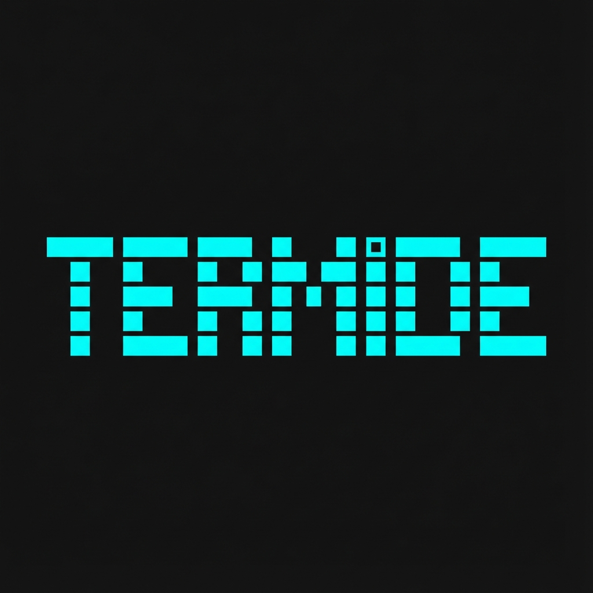

<p align="center">
  
</p>

<h1 align="center">termide</h1>

<p align="center">
  <strong>Minimalist & Elegant Terminal-First IDE</strong>
</p>

---


**termide** is a minimalist and elegant Terminal-first IDE designed for the modern developer. 

The name is a playful fusion of **Terminal** and **IDE**, with a nod to the industrious **termite** (termita)—building complex structures from the ground up, bit by bit.

## 🚀 Cómo usarlo (Quick Start)

No necesitas clonar el repo si solo quieres probarlo. Puedes ejecutarlo directamente con **Bun**:

```bash
# Abrir el directorio actual
bunx github:Nachx639/termide

# Abrir un proyecto específico
bunx github:Nachx639/termide ./mi-proyecto
```

## 🛠 Instalación

### Instalación Global
Si quieres tenerlo siempre a mano como un comando del sistema:

```bash
bun install -g github:Nachx639/termide
# Después de esto, solo escribe:
termide
```

### Instalación en un Proyecto
Si prefieres tenerlo como herramienta de desarrollo en tu proyecto:

```bash
bun add -d github:Nachx639/termide
```
Luego añade esto a tu `package.json`:
```json
"scripts": {
  "ide": "termide ."
}
```

## ⌨️ Atajos de Teclado (Cheat Sheet)

Para que te muevas como un pro en la terminal:

| Tecla | Acción |
| :--- | :--- |
| `Tab` | Cambiar entre paneles (Árbol, Editor, Terminal) |
| `Shift + Tab` | Cambiar panel (hacia atrás) |
| `1` | Ir al **Árbol de archivos** |
| `2` | Ir al **Visor de código** |
| `3` | Ir a la **Terminal** |
| `↑ / ↓` | Navegar en el árbol o hacer scroll en código |
| `Enter` | Abrir archivo seleccionado |
| `Ctrl + Q` | Salir de termide |

## 🛠 Desarrollo Local

Si quieres contribuir o modificar el código:

1. Clona el repo.
2. Instala dependencias: `bun install`
3. Corre en modo dev: `bun run dev`

---

*Built with ❤️ for the terminal lovers.*


