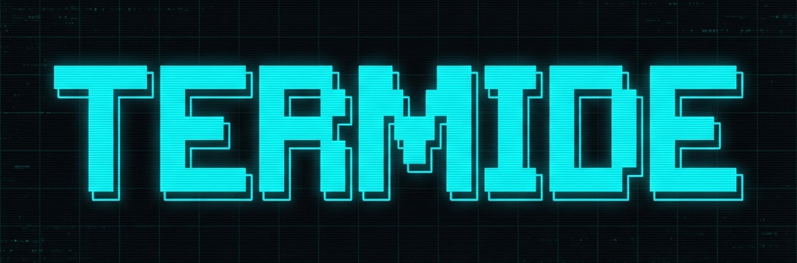
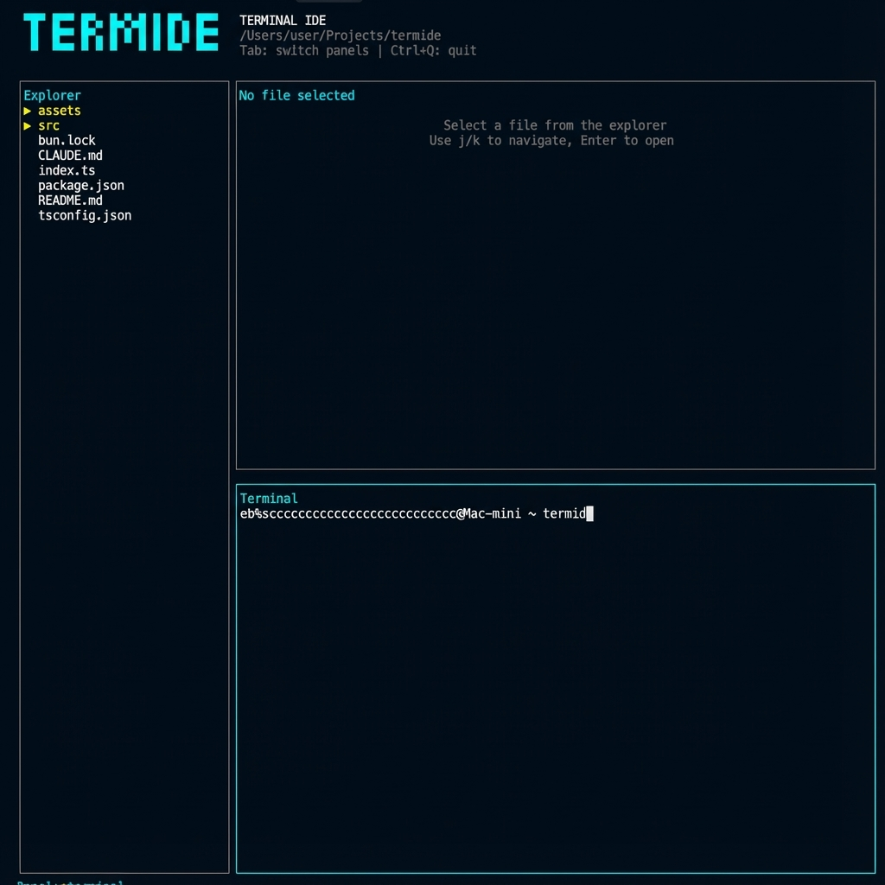

<p align="center">
  
</p>

<p align="center">
  <strong>Minimalist & Elegant Terminal-First IDE</strong>
</p>

---

<p align="center">
  
</p>

---


**termide** is a minimalist and elegant Terminal-first IDE designed for the modern developer. 

The name is a playful fusion of **Terminal** and **IDE**, with a nod to the industrious **termite**—building complex structures from the ground up, bit by bit.

## 🚀 Quick Start

Run it directly using **Bun**:

```bash
# Open current directory
bunx termide

# Open a specific project
bunx termide ./my-project
```

## 🛠 Installation

### Global Installation
To use the `termide` command anywhere:

```bash
bun install -g termide
```

### For Developers (Local Link)
If you are working on the code and want to use your local version globally:

```bash
# Inside the termide folder
bun link

# Now you can use 'termide' anywhere!
termide .
```

## ⌨️ Keyboard Shortcuts (Cheat Sheet)

Navigate like a pro in the terminal:

| Key | Action |
| :--- | :--- |
| `Tab` | Switch between panels (Tree, Editor, Terminal) |
| `Shift + Tab` | Switch panel (backward) |
| `1` | Focus **File Tree** |
| `2` | Focus **Code Viewer** |
| `3` | Focus **Terminal** |
| `↑ / ↓` | Navigate tree or scroll through code |
| `Enter` | Open selected file |
| `Ctrl + Q` | Quit termide |

## 🛠 Local Development

If you want to contribute or modify the code:

1. Clone the repo.
2. Install dependencies: `bun install`
3. Run in dev mode: `bun run dev`

---

*Built with ❤️ for terminal lovers.*

> **Tip**: If `termide` is not found after global install, ensure your Bun bin directory is in your PATH: `export PATH="$HOME/.bun/bin:$PATH"`

