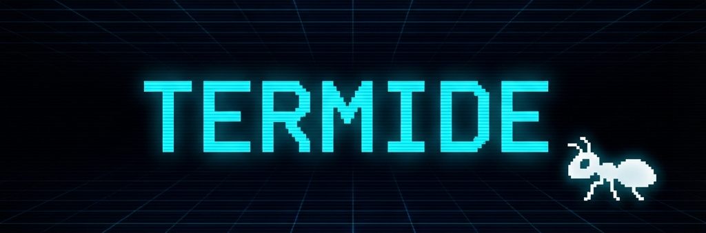

<p align="center">
  
</p>

<h3 align="center">🐜 Terminal-First IDE for AI Coding Agents</h3>

<p align="center">
  <strong>Fast. Elegant. Keyboard-driven.</strong>
</p>

<p align="center">
  <a href="https://www.npmjs.com/package/termide"></a>
  <a href="https://github.com/Nachx639/termide/stargazers"></a>
  <a href="https://github.com/Nachx639/termide/blob/main/LICENSE"></a>
  
  
</p>

---

<p align="center">
  
</p>

---

## ✨ Why termide?

**termide** is a minimalist, terminal-native IDE built for developers who:
- 🤖 Work with **AI coding assistants** (Claude Code, Aider, etc.)
- ⌨️ Prefer **keyboard-driven** workflows over mouse clicks
- ⚡ Want **instant startup** and minimal resource usage
- 🎨 Love a **clean, distraction-free** interface

The name is a playful fusion of **Terminal** + **IDE**, with a nod to the industrious **termite**—building complex structures from the ground up, bit by bit.

---

## 🤖 Built for AI Coding Agents

Unlike traditional IDEs, **termide** is designed with AI-first workflows in mind:

| Traditional IDEs | termide |
| :--- | :--- |
| Heavy GUI, slow startup | Instant launch, minimal footprint |
| Mouse-dependent workflows | 100% keyboard-driven |
| AI tools run in separate terminal | AI agent runs **inside** your IDE |
| Context switch between windows | Everything in one view |
| Complex plugin systems | Simple, focused, opinionated |

### Perfect for:
- **Claude Code** — Full-screen terminal with file browser context
- **Gemini CLI** — Google's Gemini in ACP mode
- **Aider** — See git changes while AI codes
- **Custom agents** — PTY access for any terminal-based AI

> **The insight:** AI agents don't need syntax highlighting or autocomplete—they need a **clean terminal** with **file context**. That's exactly what termide provides.

### 🌀 AI Agent Panel

termide includes a dedicated **Agent Panel** that connects to AI coding agents using the [Agent Client Protocol (ACP)](https://github.com/anthropics/acp):

| Agent | Status |
| :--- | :--- |
| 🤖 **Claude Code** | ✅ Full support (requires `claude-code-acp`) |
| 🌀 **Claude (Antigravity)** | ✅ Free tokens via [Antigravity proxy](https://github.com/badri-s2001/antigravity-claude-proxy) |
| ✨ **Gemini CLI** | ✅ Full support (`gemini --experimental-acp`) |
| ⚙️ **Custom** | ✅ Any ACP-compatible agent |

**To use Antigravity (free Claude/Gemini tokens):**
1. Install the proxy: `npm install -g antigravity-claude-proxy`
2. Log in: `antigravity-claude-proxy start` (first time only)
3. Select "🌀 Claude (Antigravity)" in termide's Agent Panel
4. Choose your model and start coding!

---

### Built With Modern Tech

- **[Bun](https://bun.sh)** — Lightning-fast JavaScript runtime
- **[React 19](https://react.dev)** — Declarative UI components
- **[OpenTUI](https://github.com/nickmccurdy/opentui)** — Terminal UI framework with Yoga layout

---

## 🚀 Quick Start

Run it directly using **Bun** (no install needed):

```bash
# Open current directory
bunx termide

# Open a specific project
bunx termide ./my-project
```

## 📦 Installation

### Global Install (Recommended)

```bash
bun install -g termide
```

Then use it anywhere:

```bash
termide .
termide ~/Projects/my-app
```

### For Contributors

```bash
git clone https://github.com/Nachx639/termide.git
cd termide
bun install
bun run dev
```

---

## ⌨️ Keyboard Shortcuts

Navigate like a pro:

| Key | Action |
| :--- | :--- |
| `Tab` / `Shift+Tab` | Cycle between panels |
| `Ctrl + F` | **Focus Mode** — maximize current panel |
| `Ctrl + P` | Quick open file (fuzzy finder) |
| `Ctrl + K` | Command Palette |
| `Ctrl + Shift + F` | Global search in files |
| `Ctrl + B` | Help panel |
| `Ctrl + G` | Toggle mascot 🐜 |
| `Ctrl + Q` | Quit |

---

## 🎯 Features

- **📁 File Explorer** — Git-aware file tree with icons
- **📝 Code Viewer** — Syntax highlighting, line numbers
- **💻 Embedded Terminal** — Full PTY with scrollback
- **🔍 Fuzzy Finder** — Quick file navigation (Ctrl+P)
- **🎨 Command Palette** — VS Code-style commands (Ctrl+K)
- **🔎 Global Search** — Ripgrep-powered search
- **🌿 Git Integration** — Branch, status, commit graph
- **🐜 Mascot** — Because why not?

---

## 🛠 Roadmap

- [ ] Multi-tab editing
- [ ] Inline code editing (not just viewing)
- [ ] Plugin system
- [ ] Themes
- [ ] LSP support

---

## 🤝 Contributing

Contributions welcome! Feel free to open issues or PRs.

---

## 📄 License

MIT © [Nachx639](https://github.com/Nachx639)

---

<p align="center">
  <em>Built with ❤️ for terminal lovers</em>
</p>

> **Tip**: If `termide` is not found after global install, ensure your Bun bin directory is in your PATH:  
> `export PATH="$HOME/.bun/bin:$PATH"`
